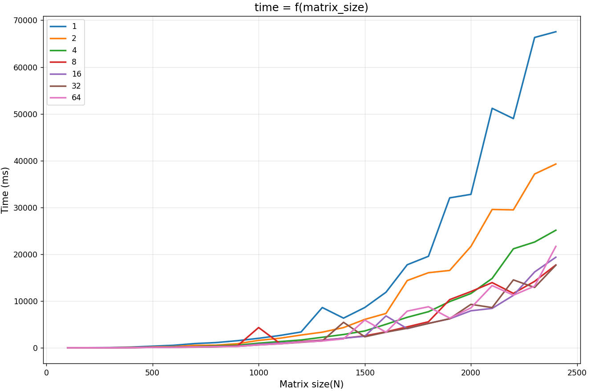

# *Лабораторная работа №16*

<details>
<summary> На 3... </summary>

## На оценку 3

1. При помощи команды **pthread_create()** создадим дочерний поток. В отдельной функции пропишем вывод строк:
```c
pthread_create(tid, NULL, routine, NULL);
```
Результат:
```
parental[i] = 1
parental[i] = 2
parental[i] = 3
parental[i] = 4
parental[i] = 5
subsidiary[i] = 1
subsidiary[i] = 2
subsidiary[i] = 3
subsidiary[i] = 4
subsidiary[i] = 5
```

2. Добавив функцию **pthread_join()** дождемся завершения работы дочернего потока и объединим потоки в один. Тогда вывод будет:
```
subsidiary[i] = 1
subsidiary[i] = 2
subsidiary[i] = 3
subsidiary[i] = 4
subsidiary[i] = 5
parental[i] = 1
parental[i] = 2
parental[i] = 3
parental[i] = 4
parental[i] = 5
```

3. Создадим двумерный массив со строками. В функцию routine добавим прием массивов из внешнего:
```c
void *routine(void *var) {
    char** text = var;
    for (int i = 0; i < 3; i++) {
        printf("%s ", text[i]);
    }
    printf("\n");
    return NULL;
}
```
Циклом создадим 4 дочерних потока:
```c
for (int i = 0; i < 4; i++) {
        pthread_create(&tid[i], NULL, routine, strings[i]);
    }
    
for (int i = 0; i < 4; i++) {
    pthread_join(tid[i], NULL);
}
```
Результат:
```
Поток 1 Бумага Камень 
Поток 2 Чай Печенька 
Поток 3 Ключ Замок 
Поток 4 Лыжи Винтовка 
parental[i] = 1
parental[i] = 2
parental[i] = 3
parental[i] = 4
parental[i] = 5
```

4. Добавим функцию **pthread_cancel()**, чтобы отменить выполнение созданных потоков:
```c
for (int i = 0; i < 4; i++) {
        pthread_cancel(tid[i]);
        pthread_join(tid[i], NULL);
        printf("Прервано: %d поток\n", i + 1);
    }
```
Результат:
```
... 
Замок 
Печенька 
Прервано: 1 поток
Прервано: 2 поток
Прервано: 3 поток
Прервано: 4 поток
```

5. Добавим команду **pthread_cleanup_push()** для помещения потока в стек очистки и команду **pthread_cleanup_pop()** для очистки потока.
```c
void *routine(void *var) {
    char** text = var;
    pthread_cleanup_push(AtExit, text[0]);
    ...
    pthread_cleanup_pop(1);
    return NULL;
}
```
также напишем доп. функцию для оповещения о завершении работы потока:
```c
void AtExit(void *var) {
    printf("%s завершен\n", (char*)var);
}
```
Результат:
```
...
Замок 
Печенька 
Поток 1 завершен
Прервано: 1 поток
Поток 2 завершен
Прервано: 2 поток
Поток 3 завершен
Прервано: 3 поток
Поток 4 завершен
Прервано: 4 поток
```

6. Реализуем сортировку сном для массива из случайных 32 чисел:
```c
void *sleepSort(void *var) {
    int* time = (int*)var;
    usleep(*time * 10000);
    printf("%d ", *time);
    return NULL;
}
```
Результат:
```
Неотсортированный массив >> 77 24 5 98 44 6 62 67 39 69 81 86 49 55 37 82 15 17 9 45 40 61 10 89 13 41 84 92 7 86 61 36 
Отсортированный массив >> 5 6 7 9 10 13 15 17 24 36 37 39 40 41 44 45 49 55 61 61 62 67 69 77 81 82 84 86 86 89 92 98
```
</details>

<details>
<summary> На 4... </summary>

## На оценку 4

6. Реализуем поочередный вывод сообщений с помощью(см. slepsort.c):
```c
pthread_mutex_t mutex = PTHREAD_MUTEX_INITIALIZER;
pthread_cond_t cond = PTHREAD_COND_INITIALIZER;
int parent_turn = 1;
```
Создадим один дополнительный поток, с которым будем синхронизировать вывод. В функции потока добавим блокировщик потока и режим ожиадния выполнения.
```c
for (int i = 0; i < 4; i++) {
    pthread_mutex_lock(&mutex);

    while (parent_turn != 0) {
        pthread_cond_wait(&cond, &mutex);
    }
    printf("%s \n", text[i]);
    parent_turn = 1;

    pthread_cond_signal(&cond);
    pthread_mutex_unlock(&mutex); 

}
```
Результат
```
Родительский поток: 1
Булочка 
Родительский поток: 2
Печенька 
Родительский поток: 3
Сметанка 
Родительский поток: 4
Блинчики 
Поток завершен
```

7. Реализуем программу перемножения квадратныx матриц(см. mult_matrix.c):
```c
int matrix_multiplication(int n, int A[n][n], int B[n][n], int C[n][n]) {
    for (int i = 0; i < n; i++) {
        for (int j = 0; j < n; j++) {
            int scalar = 0;
            for (int k = 0; k < n; k++) {
                scalar += A[i][k] * B[k][j];
            }
            C[i][j] = scalar;
        }
    }
}
```

8. Преобразуем программу, добавив выделение дополнительных потоков. Создадим структуру, в которой будем хранить данные для потоков:
```c
struct data {
    pthread_t tid;
    int n;
    int start;
    int end;
    int *A;
    int *B;
    int *C;
};
```
Будем передавать потокам N/threads строк на обработку циклом:
```c
for (int i = 0; i < threads; i++) {
    tdata[i].n = n;
    tdata[i].start = i * rows_per_thread;
    tdata[i].end = tdata[i].start + rows_per_thread;
    tdata[i].A = matrix_A;
    tdata[i].B = matrix_B;
    tdata[i].C = matrix_C;
    pthread_create(&tdata[i].tid, NULL, matrix_multiplication, &tdata[i]);
}
```
Результат:
```
time ./res
Размерность матриц >> 2000
Количество потоков >> 1
Матрица C[0][0] = 2000

real    0m35.534s
user    0m35.559s
sys     0m0.074s
---------------------
time ./res
Размерность матриц >> 2000
Количество потоков >> 100
Матрица C[0][0] = 2000

real    0m7.320s
user    1m32.608s
sys     0m0.447s
```

9. Проведем исследование зависимости времени исполнения программы от размера матрицы:


</details>

<details>
<summary> На 5... </summary>

## На оценку 5

10. Реализуем очередь (FIFO):
```c
typedef struct {
    Message buff[10];
    int head;
    int tail;
    int count;
    pthread_mutex_t lock;
    pthread_cond_t cond;
    bool is_run;
} FIFO_t;
```
Функция, отправляющая сообщения:
```c
int msgSend(FIFO_t *fifo, const char* msg, const char* name) {
    pthread_mutex_lock(&fifo->lock);
    while (fifo->count >= 10 && fifo->is_run) {
        printf("Очередь заполнена, ждем освобождения\n");
        pthread_cond_wait(&fifo->cond, &fifo->lock);
    }

    if (!fifo->is_run) {
        pthread_mutex_unlock(&fifo->lock);
        return -1;
    }
...
```
Функция для потока-клиента:
```c
void* client(void *var) {
    FIFO_t* fifo = (FIFO_t*)var;
    
    static _Atomic int count = 0;
    char name[NAME_SIZE];
    snprintf(name, sizeof(name), "Клиент %d", ++count);

    const char* text[] = {"Hello world!", "Cup of tea", "Event Horizon", 
                          "System of A Down", "Programming", "Wewew", "First In First Out"};
    int text_num = 7;

    for (int i = 0; i < text_num; i++) {
        int random = rand() % text_num;
        if (msgSend(fifo, text[random], name) < 0) break;

        usleep((rand() % 1000000) + 100000);
    }

    printf("[%s] Закончил отправку\n", name);
    return NULL;
}
```
Для потока-сервера:
```c
void* server(void* var) {
    void** vars = (void**)var;
    FIFO_t* fifo = (FIFO_t*)vars[0];
    int id = *(int*)vars[1];
    free(vars);
    char buff[256];

    while (1) {
        int len = msgRecv(fifo, buff, sizeof(buff));
        if (len <= 0) {
            break;
        }
        printf("[Сервер %d] Сообщение: %s\n", id, buff);
        usleep((rand() % 1000000) + 100000);
    }
    printf("[Сервер %d] Закончил работу\n", id);
    return NULL;
}
```
Результат:
```
...
 > Очередь пуста, ждем сообщений
 > Очередь пуста, ждем сообщений
[Сервер 1] Сообщение: [Клиент 1] Wewew
[Сервер 2] Сообщение: [Клиент 2] Event Horizon

...

[Сервер 1] Сообщение: [Клиент 2] System of A Down
[Сервер 1] Сообщение: [Клиент 1] First In First Out
 > [Клиент 3] Закончил отправку
 > Клиенты закончили работу
[Сервер 1] Сообщение: [Клиент 3] Programming
[Сервер 2] Сообщение: [Клиент 2] Cup of tea
[Сервер 1] Сообщение: [Клиент 3] System of A Down
[Сервер 2] Сообщение: [Клиент 1] Programming
[Сервер 2] Сообщение: [Клиент 3] Event Horizon
[Сервер 2] Сообщение: [Клиент 3] First In First Out
[Сервер 1] Сообщение: [Клиент 3] Hello world!
 > [Сервер 2] Закончил работу
 > [Сервер 1] Закончил работу
```